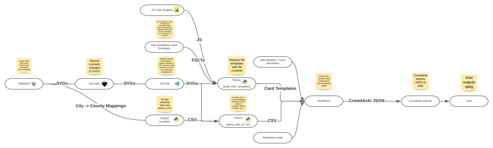

# Contributing

Hey, interested in contributing? or just curious about the project structure? 
You're in the right place.

## Set-up
(Almost identical to [Ultimate Geography](https://github.com/axelboc/anki-ultimate-geography/blob/master/CONTRIBUTING.md))

1. Install the CrowdAnki add-on in Anki.
2. Fork and clone this repository on your machine.
3. install pipenv.
4. In the root of the directory, run `pipenv install --dev` to install the python project env.
5. optionally run `pipenv shell` to activate a new shell in the python environment.

Note that this repo uses git pre-commit hooks to maintain code style and to type
lint (using flake8, black, isort, and mypy). These hooks are set up already so
you don't need to do anything - they will be run automatically before each commit. 

## Data Flow

This repo contains code and resources for constructing the data.csv file which is
used by brain brew to construct a crowdanki JSON file. It also contains the brain brew
configuration. The crowdanki add-on can then be used to import the deck to anki.

Here's a diagram explaining the high level process of how the deck is built using the contents of this repo.

## SVG IDs and anki templates
So how does Anki know which region to highlight on each card? and which colour to
highlight it? and which cards to generate?

This behaviour is specified in the templates in `src/note_models/**/templates` using 
[conditional replacement](https://docs.ankiweb.net/#/templates/generation?id=conditional-replacement)
and [template variables](https://docs.ankiweb.net/#/templates/intro?id=card-templates).

Note that the element ids in the SVG must align with the wikipedia url for counties
(with "_" replaced with space and quotes removed). This ensures unqiueness, for
example West Midlands is both a county and a region, and also ensures a reliable 
predictable mapping from cities to counties. For example the West Midlands county 
has ID **West Midlands (county)** in each svg file in `src/uk_*.svg` because it's 
Wikipedia URL is **https://en.wikipedia.org/wiki/West_Midlands_(county)** 
