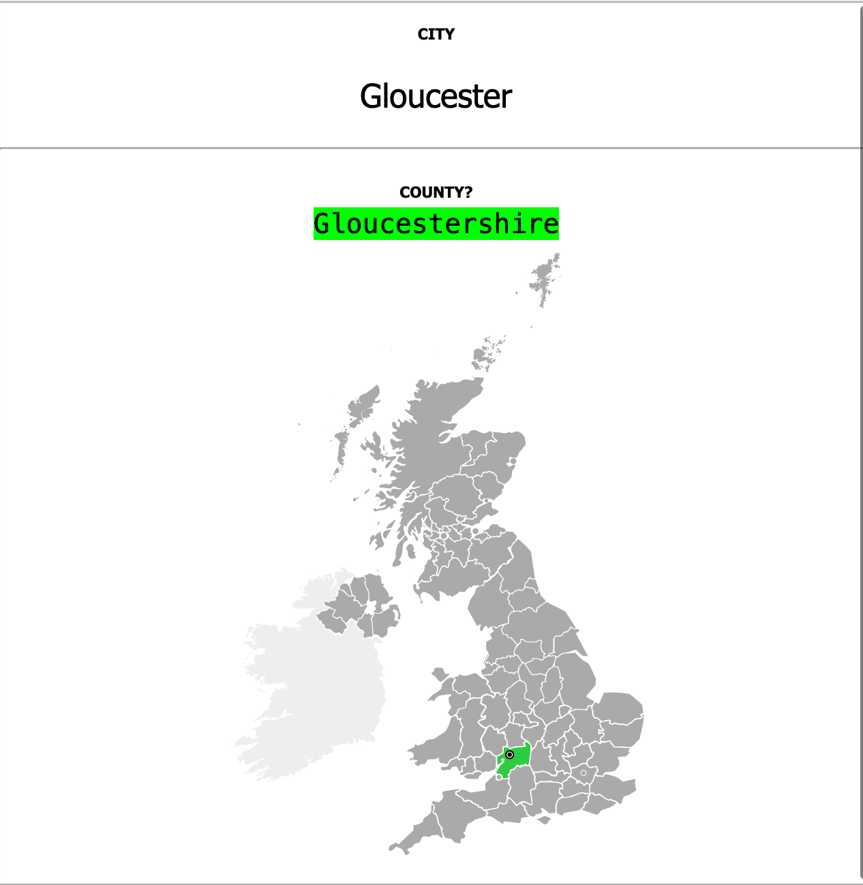
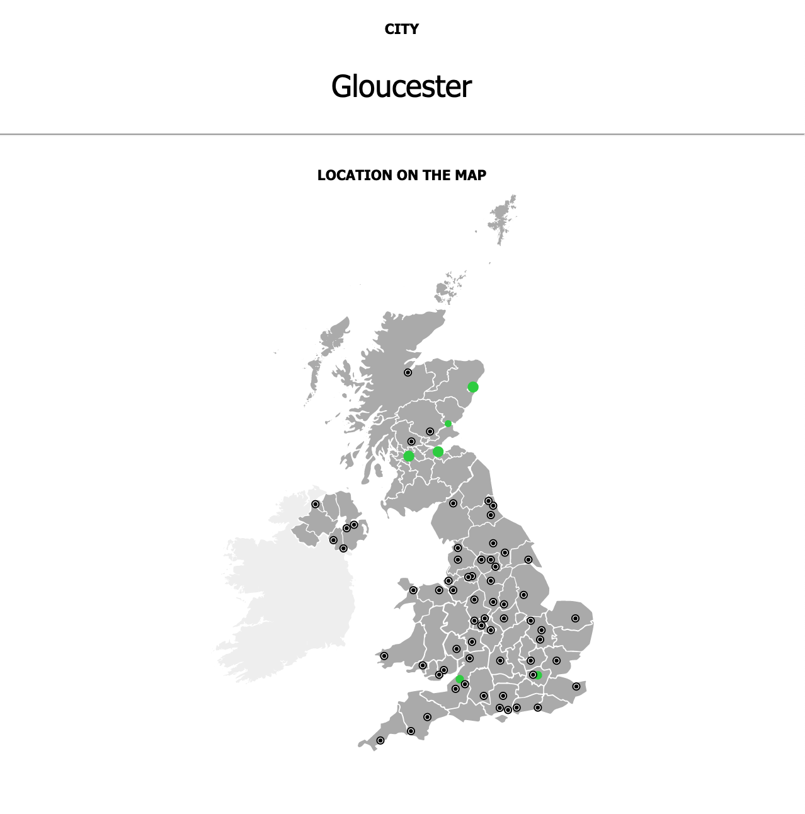
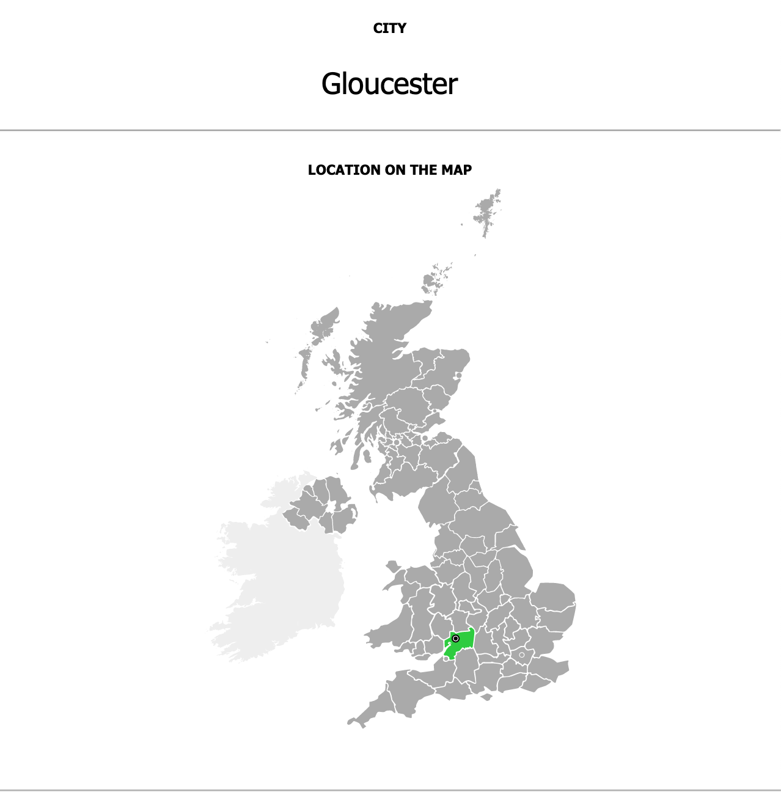
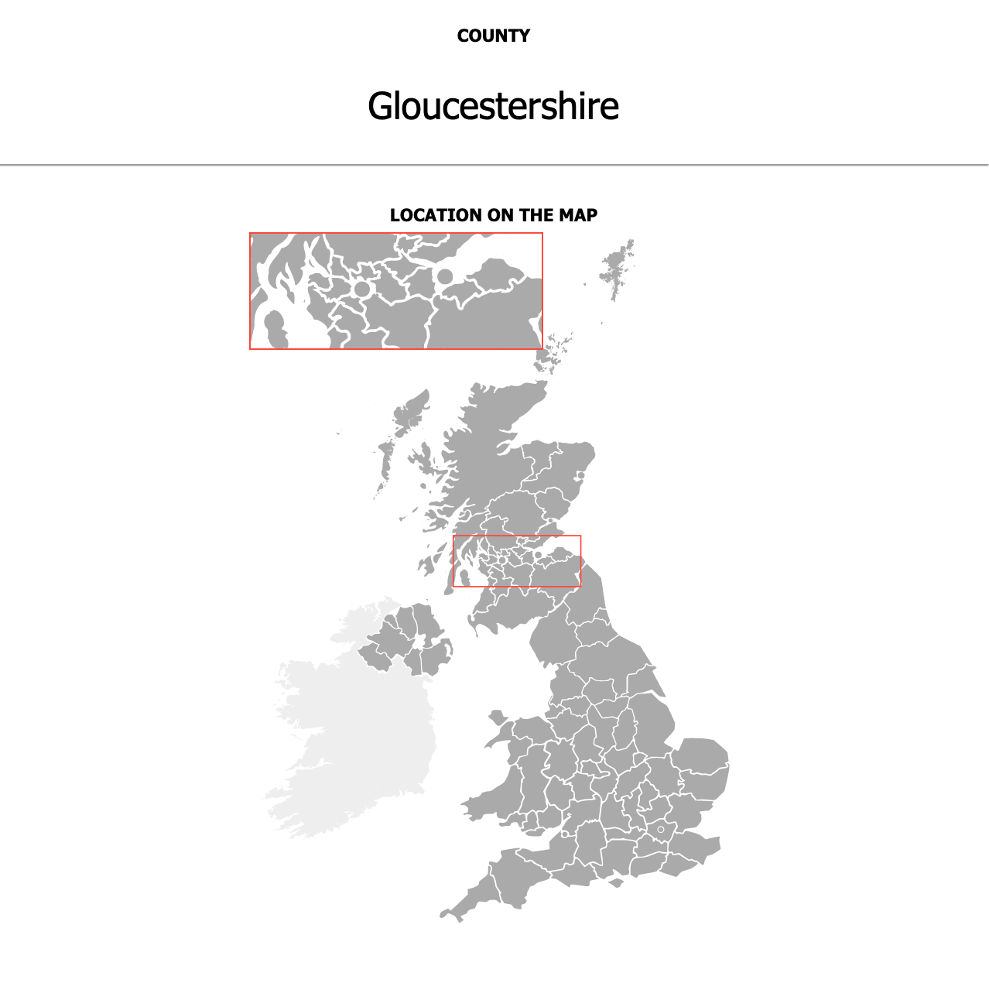
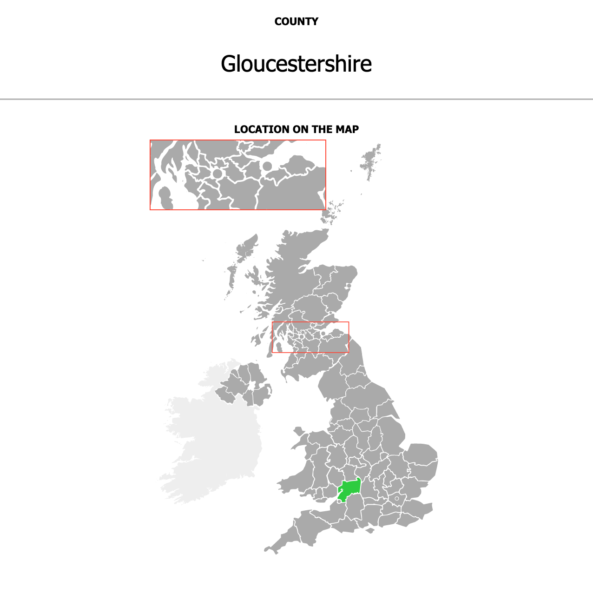
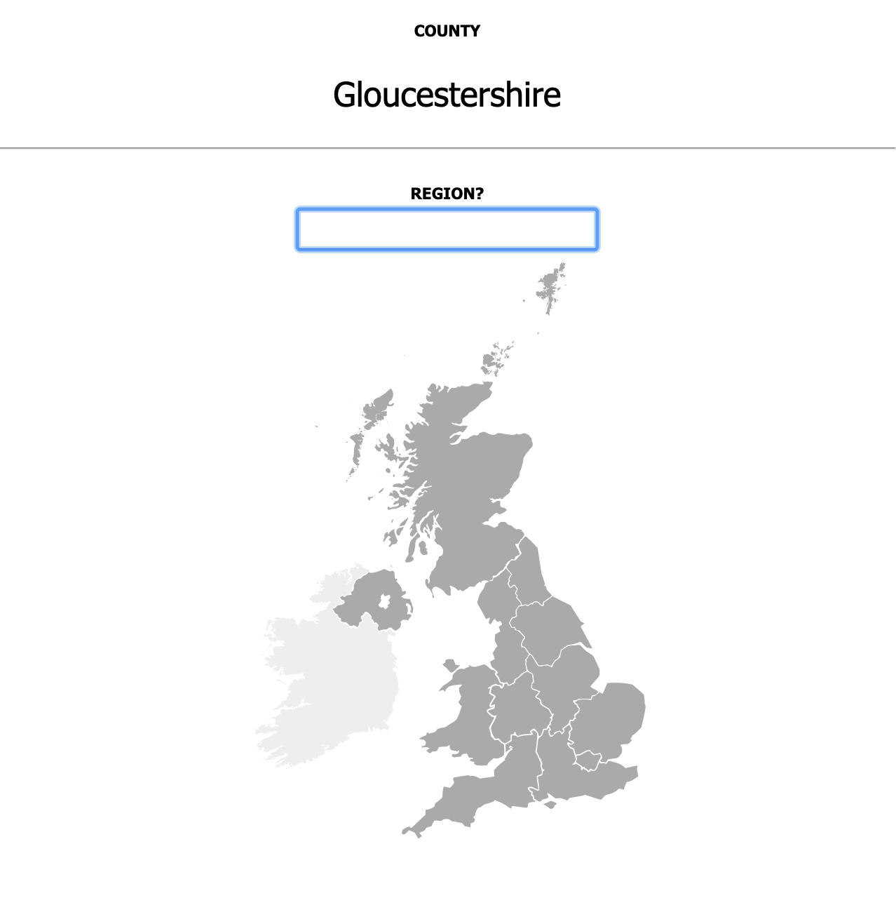
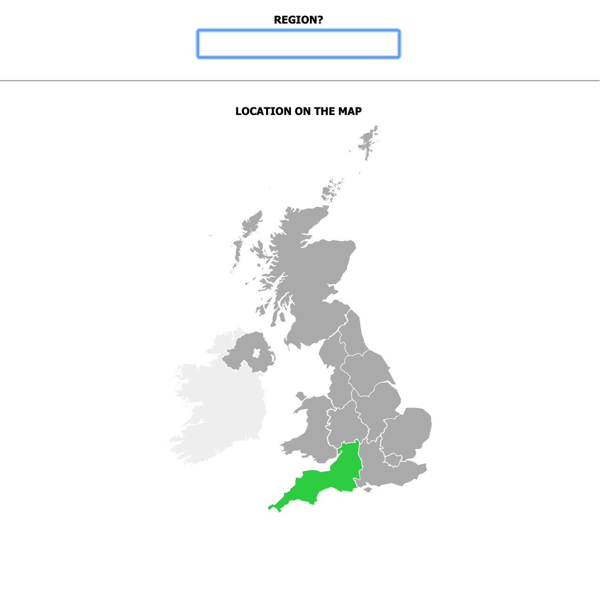
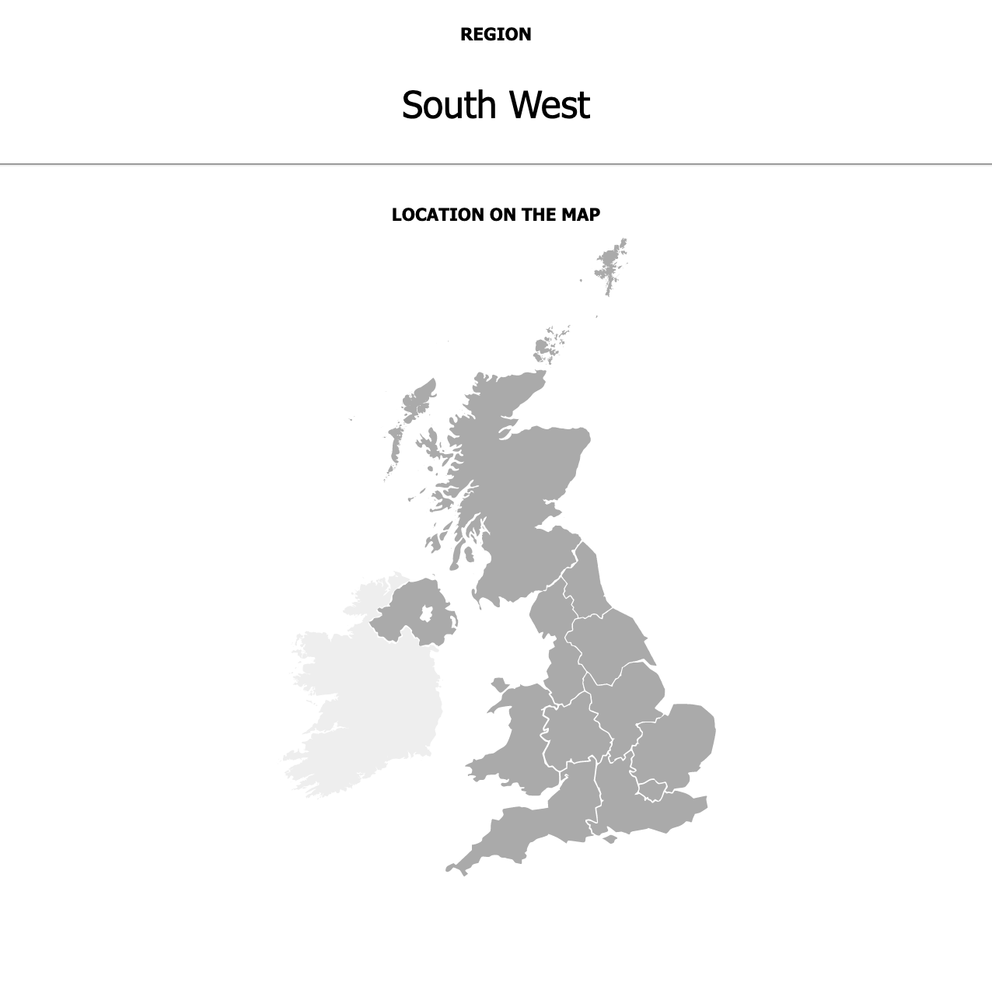
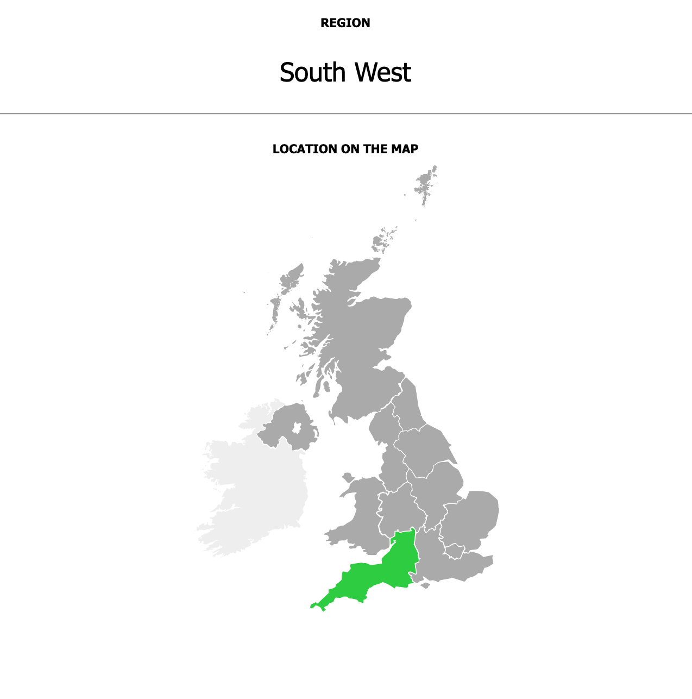

# United Kingdom (UK) Geography | Regions, Counties, and Cities

Not sure what Anki is? - [Check it out!](https://apps.ankiweb.net/)

[AnkiWeb - Download deck here!](https://ankiweb.net/shared/info/80961363)

Found a bug? Interested in adding new cards or new features? [Raise an issue](https://github.com/HartBlanc/anki-uk-geography/issues) or read the [contribution documentation](CONTRIBUTING.md). 

## Intro

Have you ever tried to research the geography of the UK and never quite managed to get your head around the seemingly endless number of disparate subdivisions? Well it's not just you, it's actually [just quite complicated](https://en.wikipedia.org/wiki/Administrative_geography_of_the_United_Kingdom) which we owe to the lack of a British constitution, variation between constituent countries, and the convoluted history of the UK.

This may mean that UK geography is not as structured as the US, for example. Despite this, Brits communicate location effectively using terms such as "The South West", "Gloucestershire", and "Gloucester". This deck aims to provide a formal and comprehensive set of cards that align with these intuitive terms that you may already have and which are likely to be understood intuitively by others. This allows existing knowledge to be leveraged and contextualised, allowing memory links to be created both bottom-up, top-down, and based on geographical proximity.

## Features

The deck will help you to learn:
- [12 top level regions](https://en.wikipedia.org/wiki/NUTS_statistical_regions_of_the_United_Kingdom) (e.g. Scotland, East of England...)
- [32 Scottish Council Areas](https://en.wikipedia.org/wiki/NUTS_statistical_regions_of_the_United_Kingdom) and 64 Ceremonial Counties for [England](https://en.wikipedia.org/wiki/Ceremonial_counties_of_England), [Wales](https://en.wikipedia.org/wiki/Preserved_counties_of_Wales), and [Northern Ireland](https://en.wikipedia.org/wiki/Counties_of_Northern_Ireland)
- [69 Official Cities](https://en.wikipedia.org/wiki/List_of_cities_in_the_United_Kingdom)
- 15 assorted seas, channels, estuaries, straits and oceans

**Deck Features**
- The deck is light-weight (~3MB, despite containing ~500 images)
- All images are Scalable Vector Graphics and therefore scale gracefully to any screen size without distortion
- Colours are distribued across maps to encourage colour-based memory retention
- CSS and JS are used to generate and animate images

## Sample Cards

Type                       |  Front                                            |  Back
:-------------------------:|:-------------------------------------------------:|:---------------------------------------------:
**Body of Water -> Map**   |         | 
**City -> County**         |     | 
**City -> Map**            |        | 
**County -> Map**          |      | 
**County -> Region**       |   | 
**Map -> Body of Water**   |         | 
**Map -> City**            |        | 
**Map -> County**          |      | 
**Map -> Region**          |      | 
**Region -> Map**          |      | 

## Acknowledgments

This deck has benefited massively from the excellent work of others including:
- Base SVGs and knowledge from [Wikipedia](https://www.wikipedia.org/) (modified)
- Open source project structure copied from [Ultimate Geography](https://ankiweb.net/shared/info/2109889812) 
- Ideas from existing Anki decks inclding [Ultimate Geography](https://ankiweb.net/shared/info/2109889812), [Counties of the United Kingdom](https://ankiweb.net/shared/info/1376524951), and [[Vector Maps] The United States of America](https://ankiweb.net/shared/info/1226689493).
- Existing software that this project benefits from includes: [crowdanki](https://github.com/Stvad/CrowdAnki), [anki-dm](https://github.com/OnkelTem/anki-dm), and of course [Anki](https://apps.ankiweb.net/)
